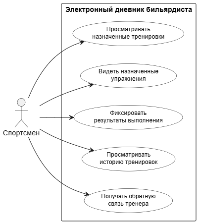
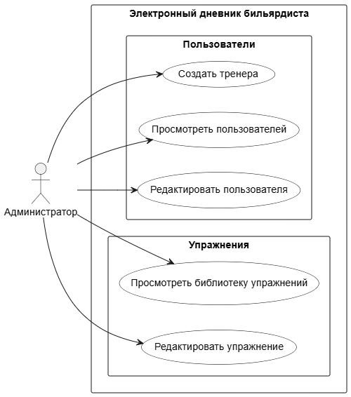

# USE CASE

<figure markdown="span">
	{align=center}
  <figcaption>Тренер</figcaption>
</figure>

<figure markdown="span">
	{align=center}
  <figcaption>Спортсмен</figcaption>
</figure>

<figure markdown="span">
	{align=center}
  <figcaption>Админ</figcaption>
</figure>
