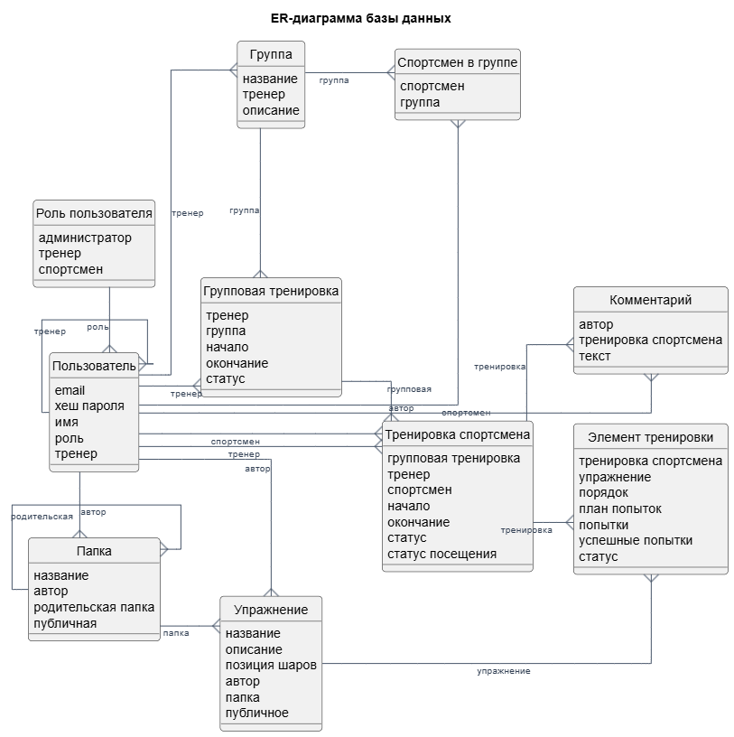
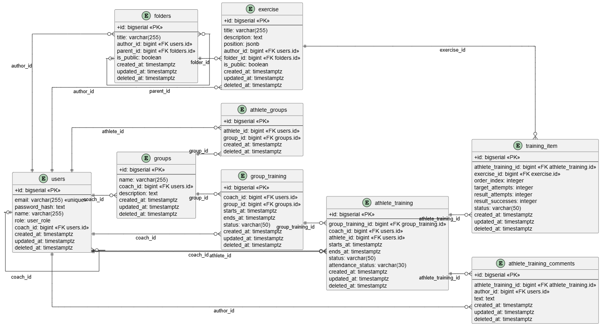

# Модель данных

<figure markdown="span">
	{align=center}
  <figcaption>Инфологическая модель</figcaption>
</figure>

<figure markdown="span">
	{align=center}
  <figcaption>Даталогическая модель</figcaption>
</figure>
