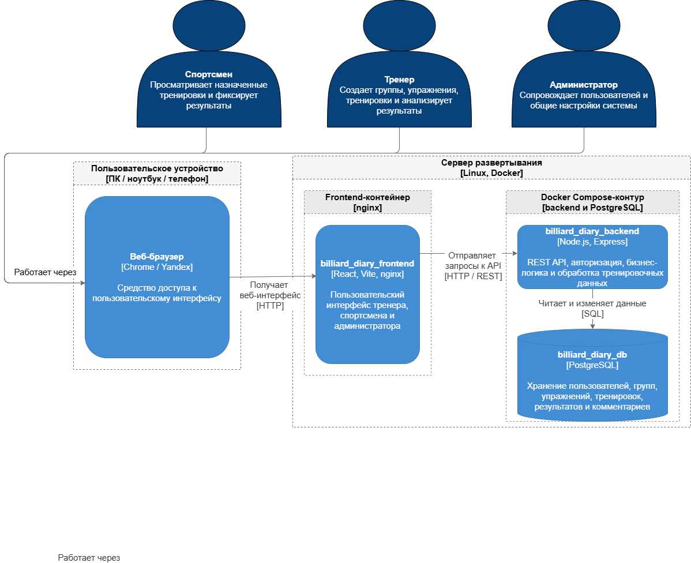

# Документация разработчика

## Назначение проекта

Billiard Diary — веб-приложение для ведения тренировочного процесса по бильярду. Система поддерживает роли администратора, тренера и спортсмена, библиотеку упражнений, группы, тренировки, посещаемость, комментарии к тренировкам и аналитические отчеты для тренера.

## Состав проекта

```text
billiard-diary/
  billiard-diary-backend/    # Node.js backend API и init.sql
  billiard-diary-frontend/   # React/Vite frontend
  docker-compose.yml         # локальный запуск БД, backend и frontend
  README.md                  # краткая инструкция запуска
```

Backend имеет слоистую структуру:

- `routes` — маршруты Express;
- `controllers` — обработка HTTP-запросов и ответов;
- `services` — бизнес-логика и проверки прав;
- `repositories` — SQL-запросы к PostgreSQL;
- `schemas` — AJV-схемы валидации входных данных;
- `middlewares` — авторизация, валидация и обработка ошибок;
- `init.sql` — создание структуры БД, индексов и демонстрационных данных.

Frontend имеет структуру:

- `pages` — страницы приложения;
- `layouts` — layout по ролям пользователей;
- `features` — функциональные модули;
- `shared` — API-клиенты, типы, UI-компоненты и auth-хранилище;
- `styles` — глобальные стили интерфейса.

## Технологии и версии

| Компонент           | Версия / пакет                       |
| ------------------- | ------------------------------------ |
| Backend runtime     | Node.js 18-alpine                    |
| Backend framework   | Express ^5.2.1                       |
| База данных         | PostgreSQL 16                        |
| Frontend build      | Node.js 22-alpine                    |
| Frontend web server | nginx 1.27-alpine                    |
| Frontend framework  | React ^19.2.0                        |
| Routing             | react-router-dom ^7.13.0             |
| Графики             | recharts ^3.8.1                      |
| Сборка frontend     | Vite ^7.3.1, TypeScript ~5.9.3       |
| Валидация backend   | AJV ^8.17.1, ajv-formats ^3.0.1      |
| Авторизация         | jsonwebtoken ^9.0.3, bcryptjs ^3.0.3 |
| PostgreSQL driver   | pg ^8.18.0                           |
| Env/CORS            | dotenv ^17.2.4, cors ^2.8.6          |

## Локальное развертывание

Для запуска требуется Docker Desktop. Node.js и PostgreSQL отдельно устанавливать не требуется, если проект запускается через Docker Compose.

Запуск из корня проекта:

```powershell
docker compose up --build
```

После запуска доступны адреса:

- frontend: `http://localhost:3106`;
- backend API: `http://localhost:3000`;
- health-check backend: `http://localhost:3000/health`;
- PostgreSQL с локального компьютера: `localhost:5433`.

Запуск по этапам:

```powershell
docker compose up --build db backend
```

Во втором терминале:

```powershell
docker compose up --build frontend
```

Остановка без удаления базы:

```powershell
docker compose down
```

Полный сброс локальной базы:

```powershell
docker compose down -v
docker compose up --build
```

`init.sql` выполняется автоматически только при первом создании volume PostgreSQL. Если структура или демо-данные в `init.sql` изменились, для повторного применения нужен сброс volume.

## Переменные окружения и порты

| Переменная                | Назначение                                                                                      |
| ------------------------- | ----------------------------------------------------------------------------------------------- |
| `PORT`                    | Порт backend внутри контейнера. По умолчанию `3000`.                                            |
| `DB_HOST`                 | В Docker Compose используется `db`; при локальном запуске backend без контейнера — `localhost`. |
| `DB_PORT`                 | Внутри Docker — `5432`; с локального компьютера — `5433`.                                       |
| `DB_USER` / `DB_PASSWORD` | Локальные значения: `postgres` / `postgres`.                                                    |
| `DB_NAME`                 | Имя локальной базы: `billiard_diary`.                                                           |
| `JWT_SECRET`              | Секрет подписи JWT. Для production должен быть заменен.                                         |
| `JWT_EXPIRES_IN`          | Время жизни JWT. По умолчанию `1h`.                                                             |
| `CORS_ORIGIN`             | Разрешенные адреса frontend. Для локального запуска: `localhost:3106` и `localhost:5173`.       |
| `VITE_API_URL`            | Адрес backend API для frontend. Для локального запуска: `http://localhost:3000`.                |

## Демо-пользователи

При создании локальной базы добавляются демонстрационные учетные записи:

| Роль          | Логин / пароль               |
| ------------- | ---------------------------- |
| Администратор | `admin@example.com / 123`    |
| Тренер        | `coach@example.com / 123`    |
| Спортсмен     | `athlete@example.com / 123`  |
| Спортсмен     | `athlete2@example.com / 123` |
| Спортсмен     | `athlete3@example.com / 123` |

Основной сценарий проверки выполняется под тренером `coach@example.com / 123`.

## Основные backend-модули

- `/auth` — авторизация и выдача JWT;
- `/users` — пользователи, тренеры и спортсмены;
- `/groups` — группы и принадлежность спортсменов к группам;
- `/folders` — папки библиотеки упражнений;
- `/exercises` — упражнения библиотеки;
- `/trainings` — групповые и персональные тренировки, элементы тренировок, посещаемость и комментарии;
- `/analytics` — read-only аналитика: фильтры, посещаемость, результативность и прогресс;
- `/health` — техническая проверка доступности backend.

## Инструкция администратора

Для сопровождения локального стенда используются команды:

```powershell
docker compose ps
docker compose logs -f backend
docker compose logs -f frontend
docker compose logs -f db
```

Если остались старые контейнеры с конфликтующими именами:

```powershell
docker rm -f billiard_diary_db billiard_diary_backend billiard_diary_frontend
```

Если нужно полностью пересоздать базу:

```powershell
docker compose down -v
docker compose up --build
```

Если занят порт frontend, в `docker-compose.yml` можно изменить внешний порт `3106:80`, например на `3107:80`.

Если занят порт backend, нужно изменить внешний порт `3000:3000` и пересобрать frontend с соответствующим `VITE_API_URL`.

## Диаграмма развертывания

<figure markdown="span">
	{align=center}
  <figcaption>Диаграмма развертывания</figcaption>
</figure>
