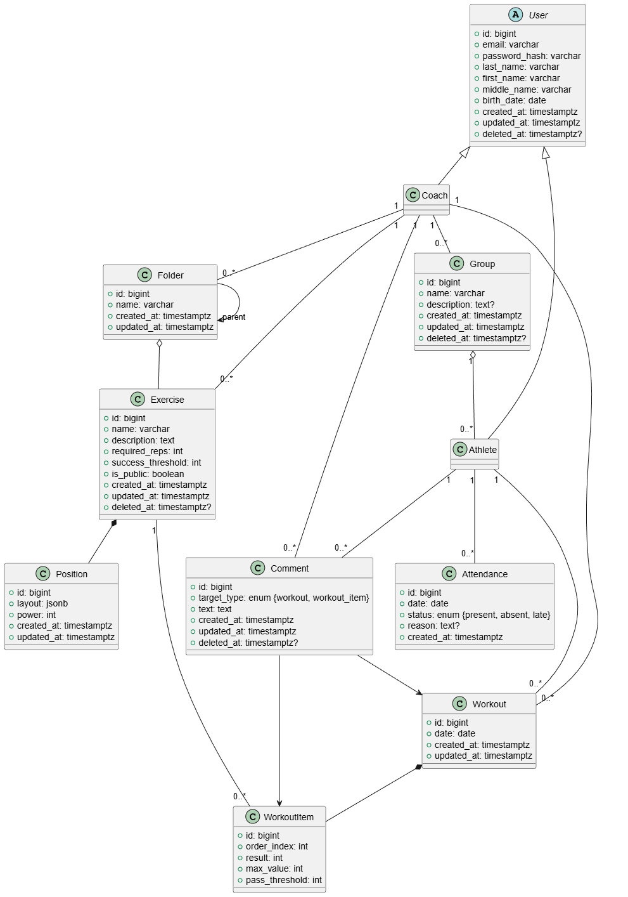
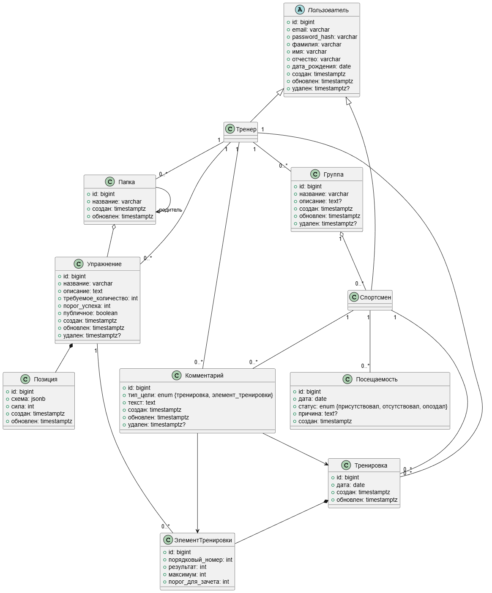
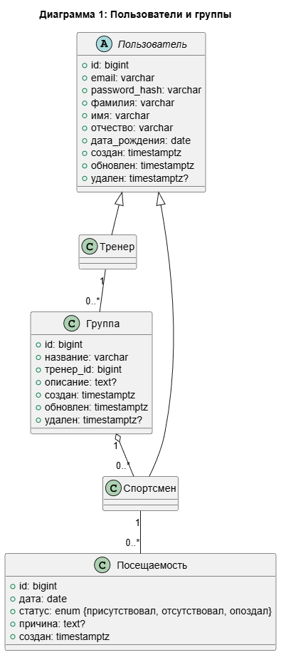
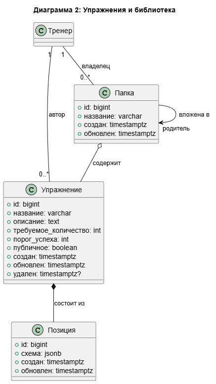
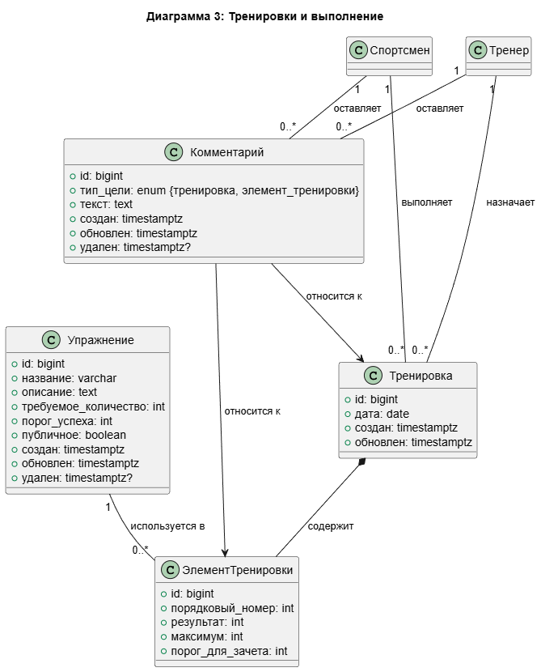

<figure markdown="span">
	{align=center}
  <figcaption>Классы EN</figcaption>
</figure>

<figure markdown="span">
	{align=center}
  <figcaption>Классы RU</figcaption>
</figure>

<figure markdown="span">
	{align=center}
  <figcaption>Классы RU 1</figcaption>
</figure>

<figure markdown="span">
	{align=center}
  <figcaption>Классы RU 2</figcaption>
</figure>

<figure markdown="span">
	{align=center}
  <figcaption>Классы RU 3</figcaption>
</figure>
