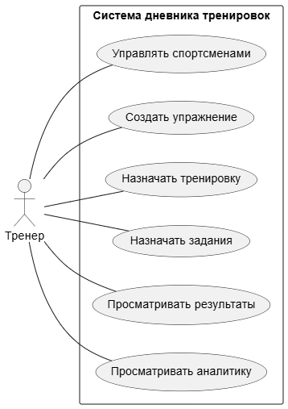

# Пользовательские требования

## Портреты пользователей системы

### 1. Администратор

**Ситуация:**

- отвечает за первичную настройку системы;
- создает и сопровождает учетные записи тренеров;
- контролирует базовую структуру данных и доступ к системе;
- может участвовать в управлении библиотекой упражнений.

**Потребности:**

- создавать тренеров;
- просматривать пользователей системы;
- редактировать данные пользователей при необходимости;
- поддерживать корректность справочной информации и библиотеки упражнений.

### 2. Тренер

**Ситуация:**

- ведет группу спортсменов разного возраста и уровня подготовки;
- регулярно формирует тренировочные задания;
- использует собственную библиотеку упражнений;
- хочет видеть выполнение заданий и динамику прогресса спортсменов.

**Потребности:**

- управлять спортсменами и группами;
- создавать упражнения со схемой позиции, винтом и силой удара;
- структурировать упражнения по папкам;
- назначать тренировку группе;
- задавать разные упражнения разным спортсменам внутри одной тренировки;
- контролировать факт выполнения, результаты и посещаемость;
- оставлять комментарии и видеть заметки спортсменов;
- анализировать посещаемость, результативность и прогресс.

### 3. Спортсмен 1: юноша 16 лет

**Ситуация:**

- занимается бильярдом несколько лет;
- стремится к спортивному росту;
- готов выполнять структурированные задания;
- хочет понимать, какие упражнения дают прогресс.

**Потребности:**

- видеть назначенные тренировки;
- запускать выполнение тренировки;
- видеть свои задания без данных других спортсменов;
- фиксировать количество попыток и успешных попыток;
- видеть историю тренировок и динамику результатов;
- получать комментарии тренера и оставлять свои заметки.

### 4. Спортсмен 2: ребенок 8 лет

**Ситуация:**

- занимается в секции по инициативе родителей;
- быстрее теряет концентрацию;
- лучше воспринимает короткие и понятные задания.

**Потребности:**

- видеть простое представление сегодняшней тренировки;
- понимать, какое упражнение нужно выполнить сейчас;
- фиксировать результат без сложных действий;
- получать наглядные упражнения со схемой расположения шаров.

## Приоритизация

Требования предполагают наличие приоритета в соответствии с градацией:

- **(P1)**: Без этого приложение теряет смысл.
- **(P2)**: Очень важно, но не блокирует работу.
- **(P3)**: Желательно, но можно без этого.
- **(P4)**: Не входит в текущую версию.

## 1. Администрирование и доступ

- **US-1.1** — Я как администратор хочу создавать тренеров, чтобы подключать новых специалистов к системе. **(P1)**
- **US-1.2** — Я как администратор хочу просматривать пользователей системы, чтобы контролировать состав участников. **(P2)**
- **US-1.3** — Я как администратор хочу редактировать данные пользователей, чтобы исправлять ошибки в учетных записях. **(P2)**
- **US-1.4** — Я как пользователь хочу входить в систему под своей учетной записью, чтобы получать доступ только к разрешенным функциям. **(P1)**
- **US-1.5** — Я как пользователь хочу, чтобы мои данные были защищены от доступа пользователей с неподходящей ролью. **(P1)**

## 2. Управление спортсменами и группами

- **US-2.1** — Я как тренер хочу добавлять новых спортсменов, чтобы включать их в тренировочный процесс. **(P1)**
- **US-2.2** — Я как тренер хочу редактировать профиль спортсмена, чтобы поддерживать данные в актуальном состоянии. **(P3)**
- **US-2.3** — Я как тренер хочу выполнять мягкое удаление спортсмена, чтобы скрывать неактуальные профили из рабочих списков. **(P4)**
- **US-2.4** — Я как тренер хочу создавать группы, чтобы организовывать спортсменов для занятий. **(P1)**
- **US-2.5** — Я как тренер хочу добавлять спортсмена в группу, чтобы назначать ему групповые тренировки. **(P1)**
- **US-2.6** — Я как тренер хочу удалять спортсмена из группы, чтобы поддерживать актуальный состав группы. **(P1)**
- **US-2.7** — Я как тренер хочу видеть карточку спортсмена, его группы и последние тренировки, чтобы быстро оценивать текущую ситуацию. **(P2)**

## 3. Работа с упражнениями

- **US-3.1** — Я как тренер хочу создавать упражнения, чтобы формировать собственную тренировочную базу. **(P1)**
- **US-3.2** — Я как тренер хочу задавать для упражнения название, описание, схему позиции, винт и силу удара, чтобы спортсмен понимал задачу. **(P1)**
- **US-3.3** — Я как тренер хочу редактировать созданные упражнения, чтобы уточнять методику выполнения. **(P2)**
- **US-3.4** — Я как тренер хочу удалять упражнения мягким удалением, чтобы скрывать неактуальные упражнения без потери связанной истории. **(P2)**
- **US-3.5** — Я как тренер хочу искать упражнения по названию, чтобы быстрее находить нужное задание. **(P2)**
- **US-3.6** — Я как тренер хочу раскладывать упражнения по папкам, чтобы не теряться в библиотеке. **(P2)**
- **US-3.7** — Я как тренер хочу использовать публичную библиотеку упражнений, созданных другими тренерами, чтобы расширять методическую базу. **(P3)**
- **US-3.8** — Я как тренер хочу создавать копию упражнения, чтобы быстро адаптировать существующее упражнение под новую задачу. **(P4)**

## 4. Планирование тренировок

- **US-4.1** — Я как тренер хочу видеть календарь тренировок, чтобы планировать работу группы по датам. **(P1)**
- **US-4.2** — Я как тренер хочу создавать тренировку для группы, чтобы назначать спортсменам упражнения на конкретное занятие. **(P1)**
- **US-4.3** — Я как тренер хочу задавать дату и время начала и окончания тренировки, чтобы фиксировать расписание занятия. **(P1)**
- **US-4.4** — Я как тренер хочу назначать разные упражнения разным спортсменам внутри одной тренировки, чтобы учитывать индивидуальные задачи. **(P1)**
- **US-4.5** — Я как тренер хочу задавать плановое количество попыток по каждому заданию, чтобы спортсмен понимал объем работы. **(P1)**
- **US-4.6** — Я как тренер хочу редактировать запланированную тренировку, чтобы корректировать дату, время и состав заданий. **(P2)**
- **US-4.7** — Я как тренер хочу отменять или отмечать пропущенные тренировки, чтобы календарь отражал фактическое состояние процесса. **(P2)**
- **US-4.8** — Я как спортсмен хочу видеть свою сегодняшнюю тренировку, чтобы понимать, какие задания нужно выполнить. **(P1)**
- **US-4.9** — Я как спортсмен хочу видеть историю своих тренировок, чтобы отслеживать выполненные занятия. **(P1)**

## 5. Выполнение тренировок и фиксация результатов

- **US-5.1** — Я как спортсмен хочу начать назначенную тренировку, чтобы перейти к выполнению заданий. **(P1)**
- **US-5.2** — Я как спортсмен хочу видеть только свои задания внутри тренировки, чтобы не отвлекаться на задания других спортсменов. **(P1)**
- **US-5.3** — Я как спортсмен хочу открыть конкретное задание и видеть связанное упражнение, чтобы понимать, что нужно выполнить. **(P1)**
- **US-5.4** — Я как спортсмен хочу фиксировать количество попыток и успешных попыток, чтобы сохранить результат выполнения. **(P1)**
- **US-5.5** — Я как спортсмен хочу завершать или пропускать задание, чтобы отразить фактическое выполнение. **(P1)**
- **US-5.6** — Я как спортсмен хочу завершить тренировку после выполнения заданий, чтобы тренер увидел итоговый статус. **(P1)**
- **US-5.7** — Я как тренер хочу видеть результаты выполнения заданий спортсменами, чтобы оценивать качество тренировки. **(P1)**

## 6. Посещаемость

- **US-6.1** — Я как тренер хочу видеть, был спортсмен на тренировке или не был, чтобы контролировать дисциплину. **(P3)**
- **US-6.2** — Я как тренер хочу просматривать посещаемость за выбранный период, чтобы видеть регулярность занятий. **(P3)**
- **US-6.3** — Я как тренер хочу видеть посещаемость по группе, чтобы оценивать вовлеченность спортсменов. **(P3)**

## 7. Аналитика

- **US-7.1** — Я как тренер хочу видеть аналитику по посещаемости, чтобы понимать регулярность тренировок. **(P2)**
- **US-7.2** — Я как тренер хочу видеть результативность спортсменов по упражнениям, чтобы оценивать качество выполнения. **(P2)**
- **US-7.3** — Я как тренер хочу видеть динамику прогресса по упражнениям, чтобы понимать, где есть рост или снижение. **(P2)**
- **US-7.4** — Я как тренер хочу фильтровать аналитику по периоду, группе, спортсмену и упражнению, чтобы анализировать нужный срез данных. **(P2)**
- **US-7.5** — Я как спортсмен хочу видеть свои результаты и историю выполнения, чтобы понимать личный прогресс. **(P2)**

## 8. Комментарии и заметки

- **US-8.1** — Я как тренер хочу оставлять комментарий к тренировке, чтобы фиксировать важные наблюдения. **(P1)**
- **US-8.2** — Я как тренер хочу оставлять комментарий к отдельному заданию, чтобы дать спортсмену конкретную обратную связь. **(P2)**
- **US-8.3** — Я как спортсмен хочу видеть комментарии тренера, чтобы понимать, что нужно исправить. **(P2)**
- **US-8.4** — Я как спортсмен хочу оставлять заметку к тренировке или заданию, чтобы передать тренеру свои ощущения и наблюдения. **(P2)**

<figure markdown="span">
	{align=center}
  <figcaption>Use Cases</figcaption>
</figure>
